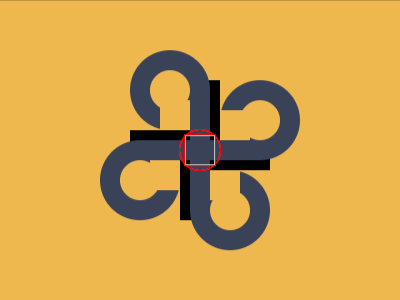

# #263. Celtic Knot

Challenge: <https://cssbattle.dev/play/263>

## Result

<table>
	<tr>
		<th width="50%">User Submission</th>
		<th width="50%">Target</th>
	</tr>
	<tr>
		<td width="50%" align="center">
			
		</td>
		<td width="50%" align="center">
			
		</td>
	</tr>
</table>

## Code

```html
<dt><dl><p><style>
  &{
    background: #EEB850;
    margin:90 140;
    border-radius:50px;
    corner-shape:notch;
    box-shadow:inset 0 9in #394257;
    outline:10px solid;
  * {
    outline:1px solid red;
    width:40;
    height:40;
    box-shadow:
      30px 60px 0 0px #EEB850,
      30px 60px 0 20px #394257;
    offset:ray(0deg);
    border-radius:1in;
    img{
      width:30;height:30;
      border-radius:0;
      color:#EEB850;
      box-shadow:
        -35px 25px,
        -25px -35px,
        25px 35px,
        35px -25px;
    }
```

## Prettified code

```html
<dt><dl><p><style>
  &{
    background: #EEB850;
    margin:90 140;
    border-radius:50px;
    corner-shape:notch;
    box-shadow:inset 0 9in #394257;
    outline:10px solid;
  * {
    outline:1px solid red;
    width:40;
    height:40;
    box-shadow:
      30px 60px 0 0px #EEB850,
      30px 60px 0 20px #394257;
    offset:ray(0deg);
    border-radius:1in;
    img{
      width:30;height:30;
      border-radius:0;
      color:#EEB850;
      box-shadow:
        -35px 25px,
        -25px -35px,
        25px 35px,
        35px -25px;
    }
```
