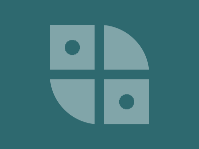

# Daily Target — Jun 15, 2026

Challenge: <https://cssbattle.dev/play/huzTWsbhbRLHx1qJWmnm>

## Result

<table>
	<tr>
		<th width="50%">User Submission</th>
		<th width="50%">Target</th>
	</tr>
	<tr>
		<td width="50%" align="center">
			
		</td>
		<td width="50%" align="center">
			
		</td>
	</tr>
</table>

## Code

```html
<style>&{background:#2d696f;*{border-radius:0 50%;margin:50 100;--g:radial-gradient(#2d696f 15px,#0000 0);background:var(--g)-58q -58q,var(--g)58q 58q,conic-gradient(at 5lh 5lh,#0000 75%,#81a5a9 0)0 0/116Q 116Q
```
