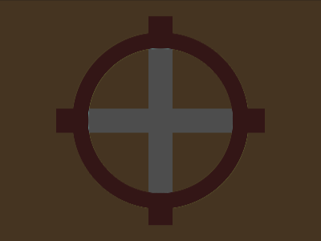

# Daily Target — Jun 17, 2026

Challenge: <https://cssbattle.dev/play/gWRvIYqOilEJ5qzQONIM>

## Result

<table>
	<tr>
		<th width="50%">User Submission</th>
		<th width="50%">Target</th>
	</tr>
	<tr>
		<td width="50%" align="center">
			
		</td>
		<td width="50%" align="center">
			
		</td>
	</tr>
</table>

## Code

```html
<style>
  * {
    border:75q solid#E8AD6D;
    margin:-50 0;
    background: conic-gradient(at 115px 115px,var(--c,#A84A4B) 75%,#E8AD6D 0)var(--p,0 0)/145px 145px;
    *{
      --c:#FFF;
      --p:35vh 35vh;
      margin:20;
      border-radius:2in;
      border:5vw solid#A84A4B;
    }
```
