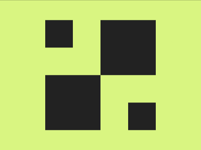

# Daily Target — Jun 26, 2026

Challenge: <https://cssbattle.dev/play/HXrAieeMjNEmOzbRlBIV>

## Result

<table>
	<tr>
		<th width="50%">User Submission</th>
		<th width="50%">Target</th>
	</tr>
	<tr>
		<td width="50%" align="center">
			
		</td>
		<td width="50%" align="center">
			
		</td>
	</tr>
</table>

## Code

```html
<style>
  * {
    color:#222;
    margin:40 200 150 90;
    box-shadow:
      inset -55px -55px 0 #D8F581,
      inset 0 2in,
      110px 0;
    background: #D8F581;
    *{
      margin:0;
      scale:-1;
      translate:110px 110px;
    }
```
