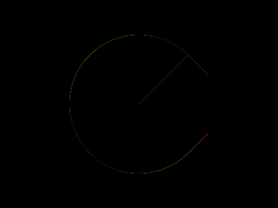
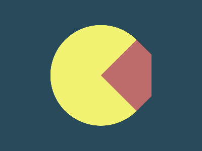

# Daily Target — Jun 28, 2026

Challenge: <https://cssbattle.dev/play/zhqVcCGcq24I4ItesJgY>

## Result

<table>
	<tr>
		<th width="50%">User Submission</th>
		<th width="50%">Target</th>
	</tr>
	<tr>
		<td width="50%" align="center">
			
		</td>
		<td width="50%" align="center">
			
		</td>
	</tr>
</table>

## Code

```html
<style>
  & {
    background: #284A5B;
  *{
    margin:50 100;
    border-radius:2in;
    background:#F1F271;
  *{
    margin:30 0 0 100;
    padding:70 50;
    background:#BE6B6C;
    border-radius:1in 38px 38px 1in;
    corner-shape:bevel;
      
    }
```
