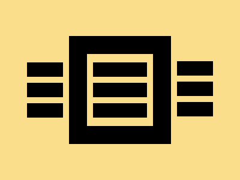

# Daily Target — Jul 2, 2026

Challenge: <https://cssbattle.dev/play/nXGWhRanLkXsKymyC5xU>

## Result

<table>
	<tr>
		<th width="50%">User Submission</th>
		<th width="50%">Target</th>
	</tr>
	<tr>
		<td width="50%" align="center">
			
		</td>
		<td width="50%" align="center">
			
		</td>
	</tr>
</table>

## Code

```html
<p><style>
  &,p {
    background:#FADE8B;
    margin:138 105 138 45;
    box-shadow:inset 0 1in,0 -34px,0 34px;
      p{
        height:24;
        margin:28 -100 0 115;
    }
    >*{
      margin:-78 10 -78 70;
      border:30px solid;
      box-shadow:inset 0 0 0 10px#FADE8B;
      outline:10px solid #FADE8B;
  }
```

## Prettified code

```html
<p><style>
  &,p {
    background:#FADE8B;
    margin:138 105 138 45;
    box-shadow:inset 0 1in,0 -34px,0 34px;
      p{
        height:24;
        margin:28 -100 0 115;
    }
    >*{
      margin:-78 10 -78 70;
      border:30px solid;
      box-shadow:inset 0 0 0 10px#FADE8B;
      outline:10px solid #FADE8B;
  }
```
