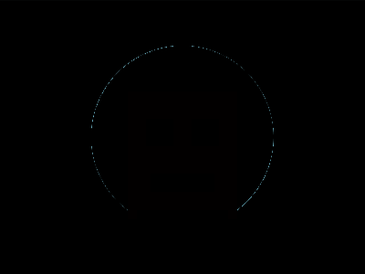

# Daily Target — Jul 3, 2026

Challenge: <https://cssbattle.dev/play/bzQ591FAfiRjAtqMae1E>

## Result

<table>
	<tr>
		<th width="50%">User Submission</th>
		<th width="50%">Target</th>
	</tr>
	<tr>
		<td width="50%" align="center">
			
		</td>
		<td width="50%" align="center">
			
		</td>
	</tr>
</table>

## Code

```html
<style>
  & {
    margin:30;
    background: radial-gradient(
      1q,
      #222 100px,
      #9BE9FD
    )50%/100%9in;
    *{
      background:#9BE9FD;
      margin:100 130 110;
      color:#222;
      box-shadow:
        inset 30px 0,
        inset -30px 0,
        0px 55px 0 -5px,
        0px -10px 0 20px #9BE9FD,
        0px 50px 0 20px #9BE9FD,
        0 80px 0 10px,
        0px 60px 0 20px #9BE9FD
 
    }
```

## Prettified code

```html
<style>
  & {
    margin:30;
    background: radial-gradient(
      1q,
      #222 100px,
      #9BE9FD
    )50%/100%9in;
    *{
      background:#9BE9FD;
      margin:100 130 110;
      color:#222;
      box-shadow:
        inset 30px 0,
        inset -30px 0,
        0px 55px 0 -5px,
        0px -10px 0 20px #9BE9FD,
        0px 50px 0 20px #9BE9FD,
        0 80px 0 10px,
        0px 60px 0 20px #9BE9FD
 
    }
```
