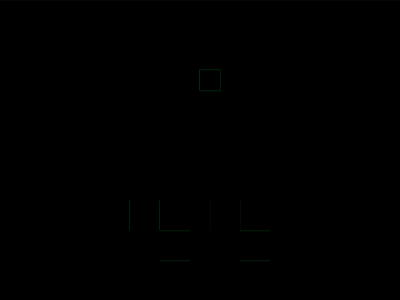

# Daily Target — Jul 4, 2026

Challenge: <https://cssbattle.dev/play/Tgh9p4ln2hnogFFpiFch>

## Result

<table>
	<tr>
		<th width="50%">User Submission</th>
		<th width="50%">Target</th>
	</tr>
	<tr>
		<td width="50%" align="center">
			
		</td>
		<td width="50%" align="center">
			
		</td>
	</tr>
</table>

## Code

```html
<style>
* {
  margin: 40 130 100;
  background: #d35c72;
  color: EFEB99;
  box-shadow: var(--s, inset 0 9in);
  * {
    --s:
      -32q 0, 0 32q, 53q 0, 5pc 32q, -5vh -45vh 0 -5px #d35c72,
      37q -45vh 0 -5q #d35c72;
    margin: 160 80 -30 30;
  }
}
</style>
```

## Prettified code

```html
<style>
* {
  margin: 40 130 100;
  background: #d35c72;
  color: EFEB99;
  box-shadow: var(--s, inset 0 9in);
  * {
    --s:
      -32q 0, 0 32q, 53q 0, 5pc 32q, -5vh -45vh 0 -5px #d35c72,
      37q -45vh 0 -5q #d35c72;
    margin: 160 80 -30 30;
  }
}
</style>
```
