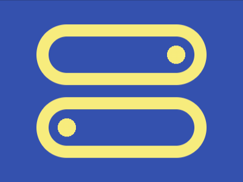
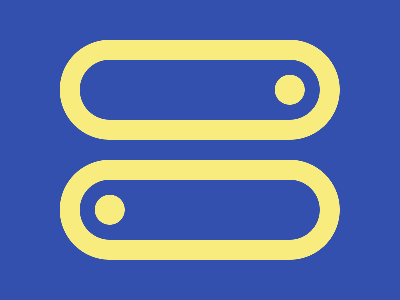

# Daily Target — Jul 5, 2026

Challenge: <https://cssbattle.dev/play/B85IWOvFPcgdhZglP3Zt>

## Result

<table>
	<tr>
		<th width="50%">User Submission</th>
		<th width="50%">Target</th>
	</tr>
	<tr>
		<td width="50%" align="center">
			
		</td>
		<td width="50%" align="center">
			
		</td>
	</tr>
</table>

## Code

```html
<style>*{border:5vw solid#F7EC7D;border-radius:1in;margin:40 60 160;background:radial-gradient(1q at 70vh,#F7EC7D 5vh,#0000)no-repeat#3450AE;*{scale:-1;margin:100-20-140
```

## Prettified code

```html
<style>
* {
  border: 5vw solid #f7ec7d;
  border-radius: 1in;
  margin: 40 60 160;
  background: radial-gradient(1Q at 70vh, #f7ec7d 5vh, transparent) no-repeat
    #3450ae;
  * {
    scale: -1;
    margin: 100 -20 -140;
  }
}

</style>
```
