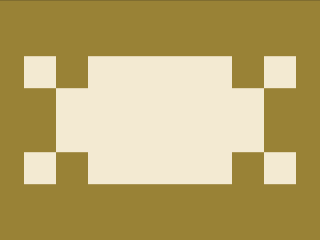
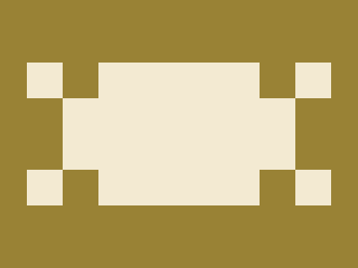

# Daily Target — Jul 6, 2026

Challenge: <https://cssbattle.dev/play/31jQ9hSUF6QsJx0qO66P>

## Result

<table>
	<tr>
		<th width="50%">User Submission</th>
		<th width="50%">Target</th>
	</tr>
	<tr>
		<td width="50%" align="center">
			
		</td>
		<td width="50%" align="center">
			
		</td>
	</tr>
</table>

## Code

```html
<style>&{background:#998235;*{margin:70 200 70 30;background:repeating-conic-gradient(#0000,25%,#998235 0 50%)0 5ch/5pc repeat-y#F3EAD2;-webkit-box-reflect:right
```

## Prettified code

```html
<style>
& {
  background: #998235;
  * {
    margin: 70 200 70 30;
    background: repeating-conic-gradient(transparent, 25%, #998235 0 50%) 0
      5ch / 5pc repeat-y #f3ead2;
    -webkit-box-reflect: right;
  }
}

</style>
```
