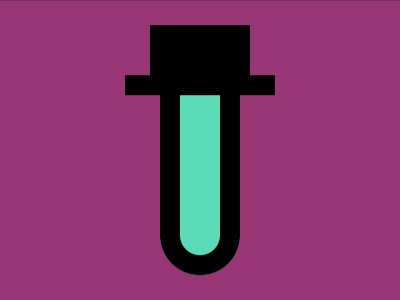

# Daily Target — Jul 7, 2026

Challenge: <https://cssbattle.dev/play/LpIgMLGpDeF12oOT28hK>

## Result

<table>
	<tr>
		<th width="50%">User Submission</th>
		<th width="50%">Target</th>
	</tr>
	<tr>
		<td width="50%" align="center">
			
		</td>
		<td width="50%" align="center">
			
		</td>
	</tr>
</table>

## Code

```html
<style>&{border:5vw solid;border-radius:1in;margin:25 160;background:#5adab8;box-shadow:0 0 0 9in#993576;*{margin:-20-55 160;background:conic-gradient(at 26Q 53Q,#000 75%,#0000 25%)0/125px
```

## Prettified code

```html
<style>
& {
  border: 5vw solid;
  border-radius: 1in;
  margin: 25 160;
  background: #5adab8;
  box-shadow: 0 0 0 9in #993576;
  * {
    margin: -20 -55 160;
    background: conic-gradient(at 26Q 53Q, #000 75%, transparent 25%) 0 / 125px;
  }
}

</style>
```
