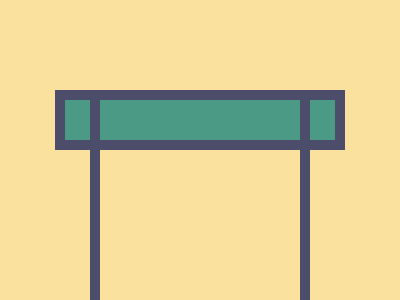

# Daily Target — Jul 8, 2026

Challenge: <https://cssbattle.dev/play/3XH4lVrpfDgTcrxgYXt5>

## Result

<table>
	<tr>
		<th width="50%">User Submission</th>
		<th width="50%">Target</th>
	</tr>
	<tr>
		<td width="50%" align="center">
			
		</td>
		<td width="50%" align="center">
			
		</td>
	</tr>
</table>

## Code

```html
<style>
  * {
    /* this is a test */
    outline:10px solid #4C4C6B;
    margin:100 100 -30;
    background: #FAE29E;
    *{
      background: #4A9A86;
      margin:0 -35 190;
```

## Prettified code

```html
<style>
  * {
    /* this is a test */
    outline:10px solid #4C4C6B;
    margin:100 100 -30;
    background: #FAE29E;
    *{
      background: #4A9A86;
      margin:0 -35 190;
```
