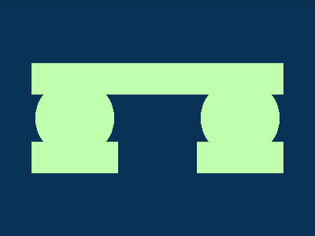
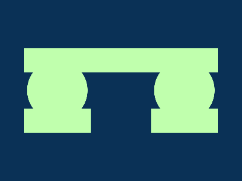

# Daily Target — Jul 9, 2026

Challenge: <https://cssbattle.dev/play/h3l8ESz0rxoqQDKXESq7>

## Result

<table>
	<tr>
		<th width="50%">User Submission</th>
		<th width="50%">Target</th>
	</tr>
	<tr>
		<td width="50%" align="center">
			
		</td>
		<td width="50%" align="center">
			
		</td>
	</tr>
</table>

## Code

```html
<style>*{border-block:5ch solid#C0FFAD;margin:80 40;background:radial-gradient(1q,#C0FFAD 53q,#0000)-53q/70vh repeat-x#0A3156;*{margin:-40 110-600
```

## Prettified code

```html
<style>
* {
  border-block: 5ch solid #c0ffad;
  margin: 80 40;
  background: radial-gradient(1Q, #c0ffad 53Q, transparent) -53Q / 70vh repeat-x
    #0a3156;
  * {
    margin: -40 110 -600;
  }
}

</style>
```
