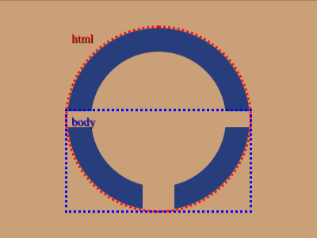

# Daily Target — Jul 10, 2026

Challenge: <https://cssbattle.dev/play/roAyjEeXtmG1qITOSiXY>

## Result

<table>
	<tr>
		<th width="50%">User Submission</th>
		<th width="50%">Target</th>
	</tr>
	<tr>
		<td width="50%" align="center">
			
		</td>
		<td width="50%" align="center">
			
		</td>
	</tr>
</table>

## Code

```html
<style>&{border:32Q solid#273e7c;border-radius:2in;margin:35 85;background:#c9a077;*{background:conic-gradient(from -90deg at 95px 5vw,#c9a077 75%,#0000 0)0/45vh;margin:75-30-30
```

## Prettified code

```html
<style>
& {
  border: 32Q solid #273e7c;
  border-radius: 2in;
  margin: 35 85;
  background: #c9a077;
  * {
    background: conic-gradient(
        from -90deg at 95px 5vw,
        #c9a077 75%,
        transparent 0
      )
      0 / 45vh;
    margin: 75 -30 -30;
  }
}

</style>
```
