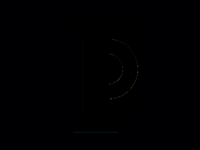
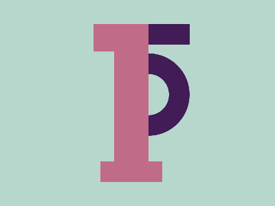

# Daily Target — Jul 12, 2026

Challenge: <https://cssbattle.dev/play/80Er6Y1RveWdX3PjVkl0>

## Result

<table>
	<tr>
		<th width="50%">User Submission</th>
		<th width="50%">Target</th>
	</tr>
	<tr>
		<td width="50%" align="center">
			
		</td>
		<td width="50%" align="center">
			
		</td>
	</tr>
</table>

## Code

```html
<style>
  & {
    margin:35 184 65 136;
    color:C06C88;
    box-shadow:
      inset -53q 5ch, 
      5vh 26q 0 5px;
    background: #6A97;
    *{
      border-top:30px solid #411C56;
      background:radial-gradient(
        1q,
        #B7D7CD 30px,
        #411C56 0 60px,
        #B7D7CD 0
      )-60px -3vw/30vw repeat-y;
      margin:0 -60 0 80;
```

## Prettified code

```html
<style>
  & {
    margin:35 184 65 136;
    color:C06C88;
    box-shadow:
      inset -53q 5ch, 
      5vh 26q 0 5px;
    background: #6A97;
    *{
      border-top:30px solid #411C56;
      background:radial-gradient(
        1q,
        #B7D7CD 30px,
        #411C56 0 60px,
        #B7D7CD 0
      )-60px -3vw/30vw repeat-y;
      margin:0 -60 0 80;
```
