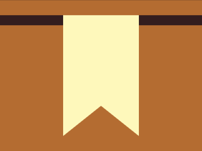

# Daily Target — Jul 13, 2026

Challenge: <https://cssbattle.dev/play/tpgHg0s1msgLUqaMEbAQ>

## Result

<table>
	<tr>
		<th width="50%">User Submission</th>
		<th width="50%">Target</th>
	</tr>
	<tr>
		<td width="50%" align="center">
			
		</td>
		<td width="50%" align="center">
			
		</td>
	</tr>
</table>

## Code

```html
<style>*{color:331D1D;border:5vw solid;margin:30-20-20;background:#B46C31;*{color:FEF8BB;border-width:60 75;margin:-20 125 30;border-bottom-color:#0000
```

## Prettified code

```html
<style>
* {
  color: 331D1D;
  border: 5vw solid;
  margin: 30 -20 -20;
  background: #b46c31;
  * {
    color: FEF8BB;
    border-width: 60 75;
    margin: -20 125 30;
    border-bottom-color: transparent;
  }
}

</style>
```
