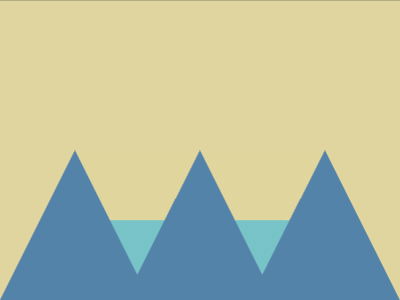

# Daily Target — Jul 14, 2026

Challenge: <https://cssbattle.dev/play/W9znsYJVH3cpo114b3YG>

## Result

<table>
	<tr>
		<th width="50%">User Submission</th>
		<th width="50%">Target</th>
	</tr>
	<tr>
		<td width="50%" align="center">
			
		</td>
		<td width="50%" align="center">
			
		</td>
	</tr>
</table>

## Code

```html
<style>
  & {
    border:solid #E0D59D;
    border-width:150 75;
    border-bottom-color:#0000;
    background: #5483A9;
    *{
      background:
        conic-gradient(
        from 206.8deg at 50% 0,
        #0000 85.2%,
        #5483A9 0
      )50%/125px
        ,
        linear-gradient(
          #E0D59D 70px,
          #78C3C7 0
        );
      margin:0 0 -124
```

## Prettified code

```html
<style>
  & {
    border:solid #E0D59D;
    border-width:150 75;
    border-bottom-color:#0000;
    background: #5483A9;
    *{
      background:
        conic-gradient(
        from 206.8deg at 50% 0,
        #0000 85.2%,
        #5483A9 0
      )50%/125px
        ,
        linear-gradient(
          #E0D59D 70px,
          #78C3C7 0
        );
      margin:0 0 -124
```
