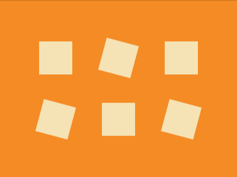
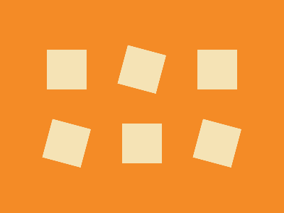

# Daily Target — Jul 15, 2026

Challenge: <https://cssbattle.dev/play/O6VovmgMqXY7lHLlAi5B>

## Result

<table>
	<tr>
		<th width="50%">User Submission</th>
		<th width="50%">Target</th>
	</tr>
	<tr>
		<td width="50%" align="center">
			
		</td>
		<td width="50%" align="center">
			
		</td>
	</tr>
</table>

## Code

```html
<style>&{background:#F48B26;margin:38 33;img{background:#F5E3B5;padding:28;margin:24 25;&[a]{rotate:15deg
```

## Prettified code

```html

<style>
& {
  background: #f48b26;
  margin: 38 33;
  img {
    background: #f5e3b5;
    padding: 28;
    margin: 24 25;
    &[a] {
      rotate: 15deg;
    }
  }
}
</style>
```
