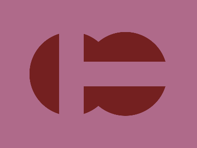

# Daily Target — Jul 16, 2026

Challenge: <https://cssbattle.dev/play/ZHdqz6FmXWrev0SARB8I>

## Result

<table>
	<tr>
		<th width="50%">User Submission</th>
		<th width="50%">Target</th>
	</tr>
	<tr>
		<td width="50%" align="center">
			
		</td>
		<td width="50%" align="center">
			
		</td>
	</tr>
</table>

## Code

```html
<style>&{--b:radial-gradient(1Q,#742020 90Q,#0000 0)fixed;background:var(--b)-58Q,var(--b)58Q#AF6A8A;*{background:conic-gradient(at 53Q 124Q,#0000 25%,#af6a8a 0)0 0/100%177Q;margin-left:120
```

## Prettified code

```html
<style>
& {
  --b: radial-gradient(1Q, #742020 90Q, transparent 0) fixed;
  background:
    var(--b) -58Q,
    var(--b) 58Q #af6a8a;
  * {
    background: conic-gradient(at 53Q 124Q, transparent 25%, #af6a8a 0) 0 0 /
      100% 177Q;
    margin-left: 120;
  }
}

</style>
```
