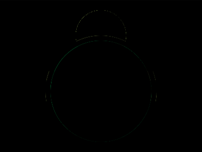
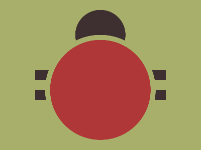

# Daily Target — Jul 17, 2026

Challenge: <https://cssbattle.dev/play/CSsYOkKJofeOzVi8zg0q>

## Result

<table>
	<tr>
		<th width="50%">User Submission</th>
		<th width="50%">Target</th>
	</tr>
	<tr>
		<td width="50%" align="center">
			
		</td>
		<td width="50%" align="center">
			
		</td>
	</tr>
</table>

## Code

```html
<style>
  & {
     border-block:20px solid #3E3030;
    margin:140 70 100;
    background: 
      radial-gradient(
        1q,
        #3E3030 50px,
        #A8AF6A 
      )50%-80px fixed;
    *{
      outline:10px solid #A8AF6A;
      border-radius:2in;
      background:#AF3737;
      margin:-80 30 -100
    }
```

## Prettified code

```html
<style>
  & {
     border-block:20px solid #3E3030;
    margin:140 70 100;
    background: 
      radial-gradient(
        1q,
        #3E3030 50px,
        #A8AF6A 
      )50%-80px fixed;
    *{
      outline:10px solid #A8AF6A;
      border-radius:2in;
      background:#AF3737;
      margin:-80 30 -100
    }
```
