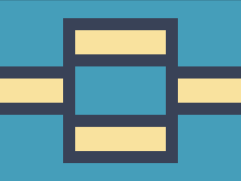

# Daily Target — Jul 18, 2026

Challenge: <https://cssbattle.dev/play/LJiv45bjokCqLDhpIzOX>

## Result

<table>
	<tr>
		<th width="50%">User Submission</th>
		<th width="50%">Target</th>
	</tr>
	<tr>
		<td width="50%" align="center">
			
		</td>
		<td width="50%" align="center">
			
		</td>
	</tr>
</table>

## Code

```html
<p><style>
  * {
    border:20px solid #394257;
    margin:110 -20;
    background: #FAE29E;
    box-shadow:0 0 0 9em#469DBA;    
    *{
      p{
        margin:40 -20;
        background:#469DBA;
        height:80
      }
      margin:-100 105;
      font:0';
```

## Prettified code

```html
<p><style>
  * {
    border:20px solid #394257;
    margin:110 -20;
    background: #FAE29E;
    box-shadow:0 0 0 9em#469DBA;    
    *{
      p{
        margin:40 -20;
        background:#469DBA;
        height:80
      }
      margin:-100 105;
      font:0';
```
