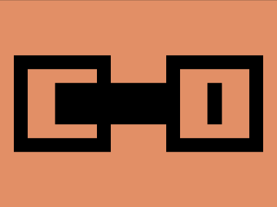

# Daily Target — Jul 19, 2026

Challenge: <https://cssbattle.dev/play/0esrz3btDFAYNYpYzP4I>

## Result

<table>
	<tr>
		<th width="50%">User Submission</th>
		<th width="50%">Target</th>
	</tr>
	<tr>
		<td width="50%" align="center">
			
		</td>
		<td width="50%" align="center">
			
		</td>
	</tr>
</table>

## Code

```html
<style>*{margin:20%60%20%20;box-shadow:inset 0 0 0 5vw,inset 63q 5ch#E38F66,inset var(--a,0)-5ch#E38F66,inset 0 2in,5pc 0 0-5ch;background:#E38F66;*{scale:-1;margin:0-220 0 220;--a:-63q
```

## Prettified code

```html
<style>
* {
  margin: 20% 60% 20% 20;
  box-shadow:
    inset 0 0 0 5vw,
    inset 63Q 5ch #e38f66,
    inset var(--a, 0) -5ch #e38f66,
    inset 0 2in,
    5pc 0 0 -5ch;
  background: #e38f66;
  * {
    scale: -1;
    margin: 0 -220 0 220;
    --a: -63Q;
  }
}

</style>
```
