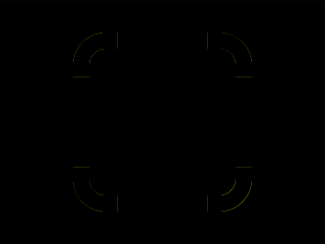

# Daily Target — Jul 20, 2026

Challenge: <https://cssbattle.dev/play/hPsHm8UmVeeb0xCAounD>

## Result

<table>
	<tr>
		<th width="50%">User Submission</th>
		<th width="50%">Target</th>
	</tr>
	<tr>
		<td width="50%" align="center">
			
		</td>
		<td width="50%" align="center">
			
		</td>
	</tr>
</table>

## Code

```html
<style>&{border-radius:42Q}*{border:5vw solid#f7ec7d;background:#682988;margin:40 90;*{margin:30;color:682988;box-shadow:0-5pc 0-5q,-5pc -0 0-5q,0 5pc 0-5q,5pc -0 0-5q
```

## Prettified code

```html
<style>
& {
  border-radius: 42Q;
}
* {
  border: 5vw solid #f7ec7d;
  background: #682988;
  margin: 40 90;
  * {
    margin: 30;
    color: 682988;
    box-shadow:
      0 -5pc 0 -5Q,
      -5pc -0 0 -5Q,
      0 5pc 0 -5Q,
      5pc -0 0 -5Q;
  }
}

</style>
```
