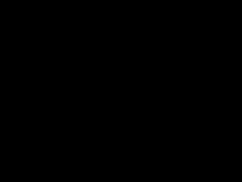
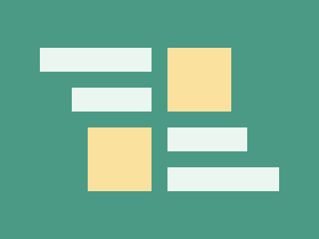

# Daily Target — Jul 21, 2026

Challenge: <https://cssbattle.dev/play/3Id7EGx422al80kPP1eQ>

## Result

<table>
	<tr>
		<th width="50%">User Submission</th>
		<th width="50%">Target</th>
	</tr>
	<tr>
		<td width="50%" align="center">
			
		</td>
		<td width="50%" align="center">
			
		</td>
	</tr>
</table>

## Code

```html
<p><p>
<style>
* {
  border-block: 32q solid #ebf6f0;
  margin: 60 50;
  background: #4a9a86;
  * {
    margin: 20 40;
    * {
      border: solid #4a9a86;
      border-width: 0 60 0 20;
      background: #fae29e;
      padding: 40;
      margin: -80 100;
      + * {
        margin: 100 47% -80 -40;
        scale: -1;
      }
    }
  }
}
</style>
```

## Prettified code

```html
<p><p>
<style>
* {
  border-block: 32q solid #ebf6f0;
  margin: 60 50;
  background: #4a9a86;
  * {
    margin: 20 40;
    * {
      border: solid #4a9a86;
      border-width: 0 60 0 20;
      background: #fae29e;
      padding: 40;
      margin: -80 100;
      + * {
        margin: 100 47% -80 -40;
        scale: -1;
      }
    }
  }
}
</style>
```
