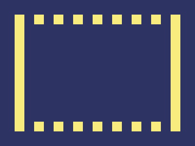

# Daily Target — Jul 22, 2026

Challenge: <https://cssbattle.dev/play/ieuuiOIavYVfNKSroxMC>

## Result

<table>
	<tr>
		<th width="50%">User Submission</th>
		<th width="50%">Target</th>
	</tr>
	<tr>
		<td width="50%" align="center">
			
		</td>
		<td width="50%" align="center">
			
		</td>
	</tr>
</table>

## Code

```html
<style>&{border:22q solid#F7EC7D;margin:30;background:#2D3464;*{margin:-20 0;background:linear-gradient(90deg,#2D3464 21q,#0000 0)0/5ch
```

## Prettified code

```html
<style>
& {
  border: 22Q solid #f7ec7d;
  margin: 30;
  background: #2d3464;
  * {
    margin: -20 0;
    background: linear-gradient(90deg, #2d3464 21Q, transparent 0) 0 / 5ch;
  }
}

</style>
```
