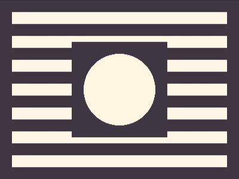
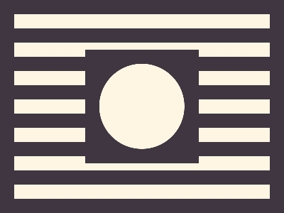

# Daily Target — Jul 23, 2026

Challenge: <https://cssbattle.dev/play/859niQYa0JbjMbzMNadA>

## Result

<table>
	<tr>
		<th width="50%">User Submission</th>
		<th width="50%">Target</th>
	</tr>
	<tr>
		<td width="50%" align="center">
			
		</td>
		<td width="50%" align="center">
			
		</td>
	</tr>
</table>

## Code

```html
<style>&{border:5vw solid#3f3642;background:linear-gradient(#FB22 5vw,#3f3642 0)0 0/1%5ch;*{margin:50 100;background:radial-gradient(#fef6e2 60px,#3f3642 0
```

## Prettified code

```html
<style>
& {
  border: 5vw solid #3f3642;
  background: linear-gradient(#fb22 5vw, #3f3642 0) 0 0 / 1% 5ch;
  * {
    margin: 50 100;
    background: radial-gradient(#fef6e2 60px, #3f3642 0);
  }
}

</style>
```
