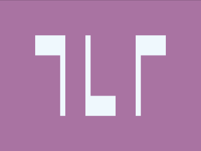

# Daily Target — Jul 24, 2026

Challenge: <https://cssbattle.dev/play/YY6aMJfEYqKa166XP3rZ>

## Result

<table>
	<tr>
		<th width="50%">User Submission</th>
		<th width="50%">Target</th>
	</tr>
	<tr>
		<td width="50%" align="center">
			
		</td>
		<td width="50%" align="center">
			
		</td>
	</tr>
</table>

## Code

```html
<style>*{margin:70 170;background:#A973A2;color:EFF8FE;box-shadow:inset 11q -42q;*{margin:0 100 0-100;scale:-1;-webkit-box-reflect:left 35vw
```

## Prettified code

```html
<style>
* {
  margin: 70 170;
  background: #a973a2;
  color: EFF8FE;
  box-shadow: inset 11Q -42Q;
  * {
    margin: 0 100 0 -100;
    scale: -1;
    -webkit-box-reflect: left 35vw;
  }
}

</style>
```
