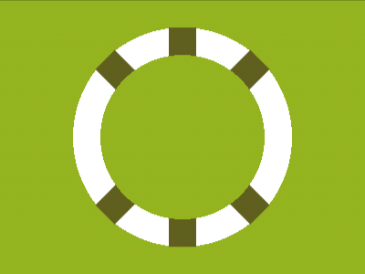
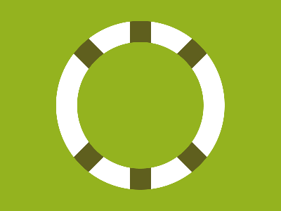

# Daily Target — Jul 25, 2026

Challenge: <https://cssbattle.dev/play/sbyqdHz6FqGxo0iTfaxX>

## Result

<table>
	<tr>
		<th width="50%">User Submission</th>
		<th width="50%">Target</th>
	</tr>
	<tr>
		<td width="50%" align="center">
			
		</td>
		<td width="50%" align="center">
			
		</td>
	</tr>
</table>

## Code

```html
<p><p>
<style>
& {
  background: radial-gradient(1Q, #94b31f 90px, #fff 0 120px, #94b31f 0) fixed;
  * {
    margin: 30 185;
    background: radial-gradient(1Q, #94b31f 90px, #5f5f1e);
    * {
      height: 100%;
      margin: 0;
      rotate: 45deg;
      + * {
        rotate: -45deg;
        margin: -240 0 0;
      }
    }
  }
}
</style>
```

## Prettified code

```html
<p><p>
<style>
& {
  background: radial-gradient(1Q, #94b31f 90px, #fff 0 120px, #94b31f 0) fixed;
  * {
    margin: 30 185;
    background: radial-gradient(1Q, #94b31f 90px, #5f5f1e);
    * {
      height: 100%;
      margin: 0;
      rotate: 45deg;
      + * {
        rotate: -45deg;
        margin: -240 0 0;
      }
    }
  }
}
</style>
```
