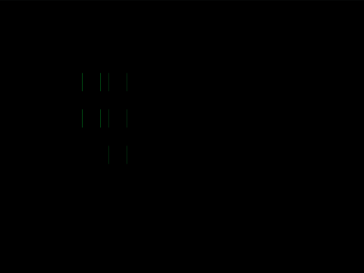

# Daily Target — Jul 27, 2026

Challenge: <https://cssbattle.dev/play/9tg5HEQqGWBN3Apa88HN>

## Result

<table>
	<tr>
		<th width="50%">User Submission</th>
		<th width="50%">Target</th>
	</tr>
	<tr>
		<td width="50%" align="center">
			
		</td>
		<td width="50%" align="center">
			
		</td>
	</tr>
</table>

## Code

```html
<style>
*{
  margin:200 230 80 150;
  background:#3450AE;
  color:#22D16A;
  --b:-32q;
  --c:-63q;
  box-shadow:inset 0 1in,
    0 -40px,
    var(--b,-30px) -40px,
    0 -5pc,
    var(--b) -5pc,
    var(--c) -5pc,
    0 -30vw,
    var(--b) -30vw,
    var(--c) -30vw,
    var(--d,-90px) -30vw;
  *{
    margin:0 -110 0 40;
    --b:5vw;
    --c:40px;
    --d:60px;
  }
```

## Prettified code

```html
<style>
*{
  margin:200 230 80 150;
  background:#3450AE;
  color:#22D16A;
  --b:-32q;
  --c:-63q;
  box-shadow:inset 0 1in,
    0 -40px,
    var(--b,-30px) -40px,
    0 -5pc,
    var(--b) -5pc,
    var(--c) -5pc,
    0 -30vw,
    var(--b) -30vw,
    var(--c) -30vw,
    var(--d,-90px) -30vw;
  *{
    margin:0 -110 0 40;
    --b:5vw;
    --c:40px;
    --d:60px;
  }
```
