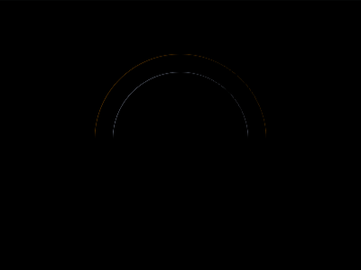

# Daily Target — Jul 30, 2026

Challenge: <https://cssbattle.dev/play/kmnEBhr0xnz7J8MSeSpa>

## Result

<table>
	<tr>
		<th width="50%">User Submission</th>
		<th width="50%">Target</th>
	</tr>
	<tr>
		<td width="50%" align="center">
			
		</td>
		<td width="50%" align="center">
			
		</td>
	</tr>
</table>

## Code

```html
<style>
  & {
    color:#696049;
    box-shadow:20px 20px,-20px 20px;
    margin:170 60 80;
    background: #F8B140;
    *{
      margin:-110 45 -20;
      border:20px solid;
      border-radius:1in 1in 0 0;
      background:conic-gradient(from 90deg at 65px 40px,#696049 25%,#FFF 0)0/85px
```

## Prettified code

```html
<style>
  & {
    color:#696049;
    box-shadow:20px 20px,-20px 20px;
    margin:170 60 80;
    background: #F8B140;
    *{
      margin:-110 45 -20;
      border:20px solid;
      border-radius:1in 1in 0 0;
      background:conic-gradient(from 90deg at 65px 40px,#696049 25%,#FFF 0)0/85px
```
