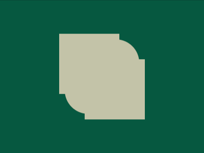

# Daily Target — Aug 1, 2026

Challenge: <https://cssbattle.dev/play/Zbbue9b0vZdg6WFTCh4C>

## Result

<table>
	<tr>
		<th width="50%">User Submission</th>
		<th width="50%">Target</th>
	</tr>
	<tr>
		<td width="50%" align="center">
			
		</td>
		<td width="50%" align="center">
			
		</td>
	</tr>
</table>

## Code

```html
<style>
  * {
    background:#065840;
    margin:66 166 127 116;
    color:#C3C3A8;
    box-shadow:inset 0 2in,50px 50px;
    *{
      background:#C3C3A8;
      border-radius:46px;
      margin:11 -39 -50 11;
      box-shadow:none;
    }
```

## Prettified code

```html
<style>
  * {
    background:#065840;
    margin:66 166 127 116;
    color:#C3C3A8;
    box-shadow:inset 0 2in,50px 50px;
    *{
      background:#C3C3A8;
      border-radius:46px;
      margin:11 -39 -50 11;
      box-shadow:none;
    }
```
