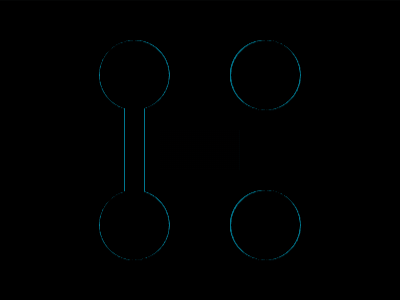

# Daily Target — Aug 2, 2026

Challenge: <https://cssbattle.dev/play/j5lNXe0bnIf95N6TxmQ7>

## Result

<table>
	<tr>
		<th width="50%">User Submission</th>
		<th width="50%">Target</th>
	</tr>
	<tr>
		<td width="50%" align="center">
			
		</td>
		<td width="50%" align="center">
			
		</td>
	</tr>
</table>

## Code

```html
<style>
  & {
    margin:70 124;
    background: #E05947;
    color:#EED9D9;
    box-shadow:inset 20px 0;
    *{
      background:conic-gradient(#EED9D9)-9px/129% 50% no-repeat;
      border:70px dotted #EED9D9;
      margin:-30 -25;
```

## Prettified code

```html
<style>
  & {
    margin:70 124;
    background: #E05947;
    color:#EED9D9;
    box-shadow:inset 20px 0;
    *{
      background:conic-gradient(#EED9D9)-9px/129% 50% no-repeat;
      border:70px dotted #EED9D9;
      margin:-30 -25;
```
