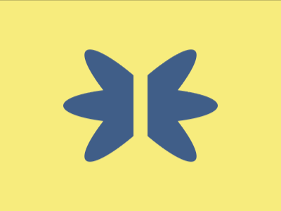

# Daily Target — Aug 3, 2026

Challenge: <https://cssbattle.dev/play/K5tl2pHRpNXPbByrJmVW>

## Result

<table>
	<tr>
		<th width="50%">User Submission</th>
		<th width="50%">Target</th>
	</tr>
	<tr>
		<td width="50%" align="center">
			
		</td>
		<td width="50%" align="center">
			
		</td>
	</tr>
</table>

## Code

```html
<dt><dl><p><style>&{margin:40 175;background:#F7EC7D;*{background:#415E88;border-radius:50%;margin:0;height:100%;offset:ray(45deg);p{background:#F7EC7D;border-radius:0;width:5vw
```

## Prettified code

```html
<dt><dl><p>
<style>
& {
  margin: 40 175;
  background: #f7ec7d;
  * {
    background: #415e88;
    border-radius: 50%;
    margin: 0;
    height: 100%;
    offset: ray(45deg);
    p {
      background: #f7ec7d;
      border-radius: 0;
      width: 5vw;
    }
  }
}
</style>
```
