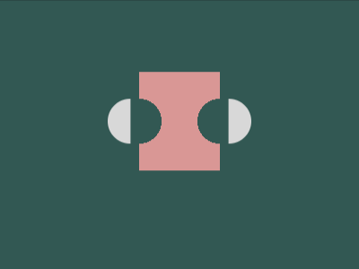

# Daily Target — Aug 4, 2026

Challenge: <https://cssbattle.dev/play/qfoEI6akJpQgni9f79Wa>

## Result

<table>
	<tr>
		<th width="50%">User Submission</th>
		<th width="50%">Target</th>
	</tr>
	<tr>
		<td width="50%" align="center">
			
		</td>
		<td width="50%" align="center">
			
		</td>
	</tr>
</table>

## Code

```html
<style>&{border-radius:1in}*{background:#D8D8D8;margin:110 120 140;color:325853;box-shadow:0 0 0 10em;*{margin:-30 35;background:radial-gradient(1q,#325853 25px,#D99795)-45px;font:6%a
```

## Prettified code

```html
<style>
& {
  border-radius: 1in;
}
* {
  background: #d8d8d8;
  margin: 110 120 140;
  color: 325853;
  box-shadow: 0 0 0 10em;
  * {
    margin: -30 35;
    background: radial-gradient(1Q, #325853 25px, #d99795) -45px;
    font: 6% a;
  }
}

</style>
```
