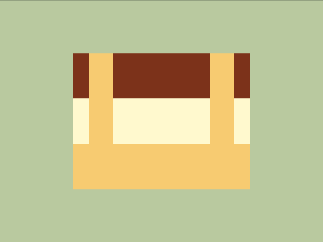

# Daily Target — Aug 5, 2026

Challenge: <https://cssbattle.dev/play/13jMnnJohZbHBrV4lGLC>

## Result

<table>
	<tr>
		<th width="50%">User Submission</th>
		<th width="50%">Target</th>
	</tr>
	<tr>
		<td width="50%" align="center">
			
		</td>
		<td width="50%" align="center">
			
		</td>
	</tr>
</table>

## Code

```html
<style>&{margin:0 90 300;background:#B9C99F;color:F7CB71;box-shadow:0 7ch#7C3219,0 7pc#FEF9CE,0 42vw;*{border-inline:32q solid;margin:66 20-180
```

## Prettified code

```html
<style>
& {
  margin: 0 90 300;
  background: #b9c99f;
  color: F7CB71;
  box-shadow:
    0 7ch #7c3219,
    0 7pc #fef9ce,
    0 42vw;
  * {
    border-inline: 32Q solid;
    margin: 66 20 -180;
  }
}

</style>
```
