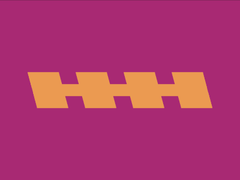

# Daily Target — Aug 7, 2026

Challenge: <https://cssbattle.dev/play/jXxptfsRY42J9Y775Pc6>

## Result

<table>
	<tr>
		<th width="50%">User Submission</th>
		<th width="50%">Target</th>
	</tr>
	<tr>
		<td width="50%" align="center">
			
		</td>
		<td width="50%" align="center">
			
		</td>
	</tr>
</table>

## Code

```html
<style>&{border:26px dashed#ea9a52;margin:30%54;transform:skew(15deg);background:#a82973;*{background:#ea9a52;margin:-6
```

## Prettified code

```html
<style>
& {
  border: 26px dashed #ea9a52;
  margin: 30% 54;
  transform: skew(15deg);
  background: #a82973;
  * {
    background: #ea9a52;
    margin: -6;
  }
}

</style>
```
