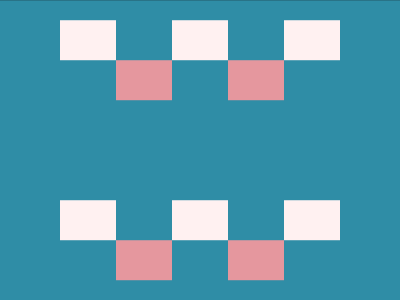

# Daily Target — Aug 8, 2026

Challenge: <https://cssbattle.dev/play/QzsqG049RL4V9DItHXt7>

## Result

<table>
	<tr>
		<th width="50%">User Submission</th>
		<th width="50%">Target</th>
	</tr>
	<tr>
		<td width="50%" align="center">
			
		</td>
		<td width="50%" align="center">
			
		</td>
	</tr>
</table>

## Code

```html
<style>
  &{
    background:#2E8DA6;
  * {
      background:conic-gradient(
        at 56px 40px,
        #2E8DA6 25%, #E5969E 0 50%,
        #2E8DA6 0 75%, #FFF1F1 0
      )0/112px;
      margin:20 60 200;
    *{
      margin:180 0 -180;
      padding:40 140;
```

## Prettified code

```html
<style>
  &{
    background:#2E8DA6;
  * {
      background:conic-gradient(
        at 56px 40px,
        #2E8DA6 25%, #E5969E 0 50%,
        #2E8DA6 0 75%, #FFF1F1 0
      )0/112px;
      margin:20 60 200;
    *{
      margin:180 0 -180;
      padding:40 140;
```
