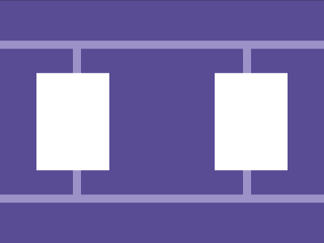
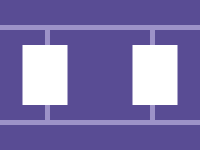

# Daily Target — Aug 9, 2026

Challenge: <https://cssbattle.dev/play/QTeWMIkTXmaFuhHHvNZ8>

## Result

<table>
	<tr>
		<th width="50%">User Submission</th>
		<th width="50%">Target</th>
	</tr>
	<tr>
		<td width="50%" align="center">
			
		</td>
		<td width="50%" align="center">
			
		</td>
	</tr>
</table>

## Code

```html
<style>*{box-shadow:0 0 0 10px#9d92c8;margin:60 0;background:#594c94;*{margin:0 100;*{background:#fff;padding:60 45;margin:30-55;box-shadow:55vw 0#fff
```

## Prettified code

```html

<style>
* {
  box-shadow: 0 0 0 10px #9d92c8;
  margin: 60 0;
  background: #594c94;
  * {
    margin: 0 100;
    * {
      background: #fff;
      padding: 60 45;
      margin: 30 -55;
      box-shadow: 55vw 0 #fff;
    }
  }
}
</style>
```
