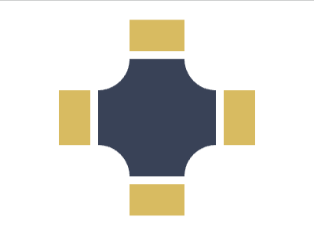

# Daily Target — Aug 15, 2026

Challenge: <https://cssbattle.dev/play/qdiV2eKiBihdqV4XlG9i>

## Result

<table>
	<tr>
		<th width="50%">User Submission</th>
		<th width="50%">Target</th>
	</tr>
	<tr>
		<td width="50%" align="center">
			
		</td>
		<td width="50%" align="center">
			
		</td>
	</tr>
</table>

## Code

```html
<style>
  & {
    margin:25 75;
    border-radius:90px;
    corner-shape:notch;
    box-shadow:inset 3in 0 #D9BB61;
    background:#FFF;
    *{
      outline:10px solid #FFFFFF;
      margin:50 50;
          border-radius:40px;
    corner-shape:scoop;
      background:#394257;
```
