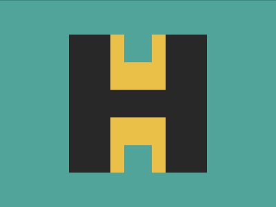

# Daily Target — Aug 18, 2026

Challenge: <https://cssbattle.dev/play/OqjzeCZTtlVTfqqvKCRg>

## Result

<table>
	<tr>
		<th width="50%">User Submission</th>
		<th width="50%">Target</th>
	</tr>
	<tr>
		<td width="50%" align="center">
			
		</td>
		<td width="50%" align="center">
			
		</td>
	</tr>
</table>

## Code

```html
<style>
  * {
    color:282828;
    border:solid;
    border-width:0 32q;
    margin:50 100;
    background: #51A499;
    *{
      border-width:0 32q 5vw;
      background:conic-gradient(#51A499 25%,#EAC049 0)60px;
      margin:0 0 100;
      -webkit-box-reflect:below
```
