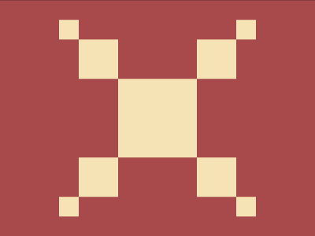

# Daily Target — Sep 2, 2026

Challenge: <https://cssbattle.dev/play/AJ9pZiNcFlllq1qpGyeW>

## Result

<table>
	<tr>
		<th width="50%">User Submission</th>
		<th width="50%">Target</th>
	</tr>
	<tr>
		<td width="50%" align="center">
			
		</td>
		<td width="50%" align="center">
			
		</td>
	</tr>
</table>

## Code

```html
<style>*{margin:25%150;background:#A84A4B;border-image:conic-gradient(#F5E3B5)999/var(--a,53q/53q);*{background:#F5E3B5;margin:0;--a:27q/79q
```
