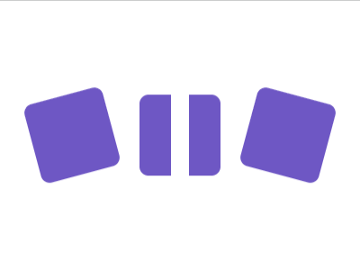

# Daily Target — Sep 6, 2026

Challenge: <https://cssbattle.dev/play/WfbQAGPzXCTFkJjKBxhZ>

## Result

<table>
	<tr>
		<th width="50%">User Submission</th>
		<th width="50%">Target</th>
	</tr>
	<tr>
		<td width="50%" align="center">
			
		</td>
		<td width="50%" align="center">
			
		</td>
	</tr>
</table>

## Code

```html
<style>
  & {
    margin:75 200;
    outline:10px solid #FFF;
    *{
      margin: 0 -180;
    
    img{
      border-radius:10px;
      padding:45;
      background:#6D57C4;
      margin:30 15;
    }
    [a]{rotate:-15deg;}
   [b]{rotate:15deg;}
```
