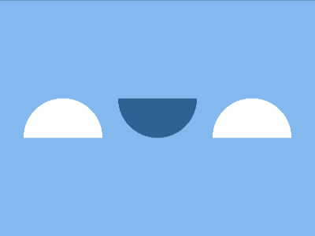
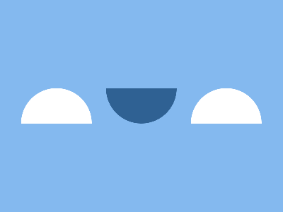

# Daily Target — Sep 7, 2026

Challenge: <https://cssbattle.dev/play/VxH9v8gyndTt19Z4EkeY>

## Result

<table>
	<tr>
		<th width="50%">User Submission</th>
		<th width="50%">Target</th>
	</tr>
	<tr>
		<td width="50%" align="center">
			
		</td>
		<td width="50%" align="center">
			
		</td>
	</tr>
</table>

## Code

```html
<style>*{margin:125 30;background:radial-gradient(1q at 53q var(--a,100%,#FFF)53q,#0000)0/60vw repeat-x#84B9EF;*{--a:0,#2F6193;margin:0 120
```
