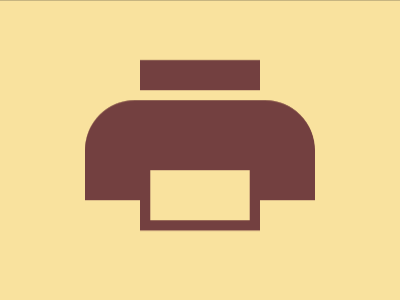

# Daily Target — Sep 16, 2026

Challenge: <https://cssbattle.dev/play/4p0BAlG4T8ddxGUbcOhn>

## Result

<table>
	<tr>
		<th width="50%">User Submission</th>
		<th width="50%">Target</th>
	</tr>
	<tr>
		<td width="50%" align="center">
			
		</td>
		<td width="50%" align="center">
			
		</td>
	</tr>
</table>

## Code

```html
<style>&{margin:25%85;border-radius:53q 53q 0 0;color:743F3F;box-shadow:inset 9in 0;background:#FAE29E;*{margin:-10 55 30;box-shadow:0-32q,0 64q 0-11q#FAE29E,0 64q
```
