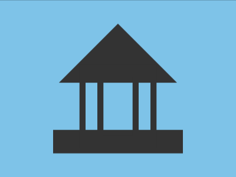
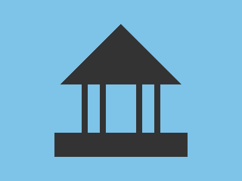

# Daily Target — Sep 17, 2026

Challenge: <https://cssbattle.dev/play/FI82QbLNuW9WtU2AemyW>

## Result

<table>
	<tr>
		<th width="50%">User Submission</th>
		<th width="50%">Target</th>
	</tr>
	<tr>
		<td width="50%" align="center">
			
		</td>
		<td width="50%" align="center">
			
		</td>
	</tr>
</table>

## Code

```html
<style>&{border:25vw solid#0000;border-bottom-color:#333;margin:-25%25%160;background:#7ec3e8;color:#333;box-shadow:0 74Q 0 10px#7ec3e8,0 116Q 0 10px;*{border-inline:5vw solid#0000;margin:120-55-200;box-shadow:0 0 0 11Q,inset 0 0 0 11Q
```
