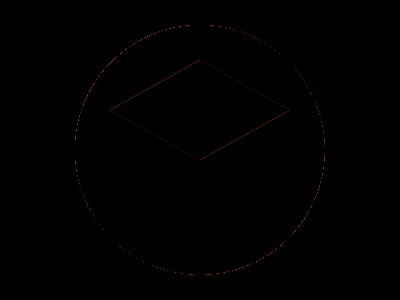

# Daily Target — Sep 19, 2026

Challenge: <https://cssbattle.dev/play/LXVlYbdUHfOS5mrqkEh0>

## Result

<table>
	<tr>
		<th width="50%">User Submission</th>
		<th width="50%">Target</th>
	</tr>
	<tr>
		<td width="50%" align="center">
			
		</td>
		<td width="50%" align="center">
			
		</td>
	</tr>
</table>

## Code

```html
<p><style>/* first try */
  & {
    background: radial-gradient(
      1q,#FFA173 125px,#485993
    )fixed;
*{
  margin:50 110 190;
    border:solid #0000;
    border-width:10 90 50;
    border-bottom-color:#485993;
  box-shadow:0 70px 0 10px#485993;
  *{
    height:50;
    scale:-1;
    border-bottom-color:#FFA173;
    margin:50 -90 -160;
    box-shadow:none;


  }
```
