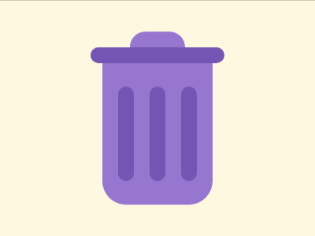
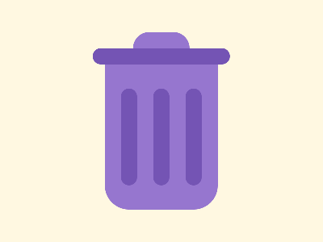

# Daily Target — Sep 25, 2026

Challenge: <https://cssbattle.dev/play/zeOBey0n5j5vQjLKIkau>

## Result

<table>
	<tr>
		<th width="50%">User Submission</th>
		<th width="50%">Target</th>
	</tr>
	<tr>
		<td width="50%" align="center">
			
		</td>
		<td width="50%" align="center">
			
		</td>
	</tr>
</table>

## Code

```html
<p><style>&{box-shadow:0 0 0 9in#FFF8E1}*{margin:60 130 40;background:#9676CF;border-radius:var(--b,0 0 32q 32q);*{--b:5vw;margin:-20 35 0;*{background:#7454B4;height:5vw;margin:2-50;img{padding:50 10;margin:50-15 0 35
```
