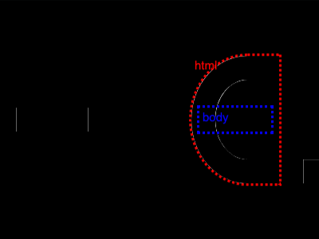

# Daily Target — Sep 28, 2026

Challenge: <https://cssbattle.dev/play/sPBh2rqUt3ilhlL5Rdhj>

## Result

<table>
	<tr>
		<th width="50%">User Submission</th>
		<th width="50%">Target</th>
	</tr>
	<tr>
		<td width="50%" align="center">
			
		</td>
		<td width="50%" align="center">
			
		</td>
	</tr>
</table>

## Code

```html
<style>
& {
  margin: 70 50 70 240;
  border: 32q solid;
  border-radius: 64% 0 0 64% / 50%;
  * {
    margin: 35 -20;
    box-shadow:
      -30vw 0,
      -243q 0,
      138q 69q #fff,
      70px 65px,
      60px 65px #fff;
  }
}
</style>
```
