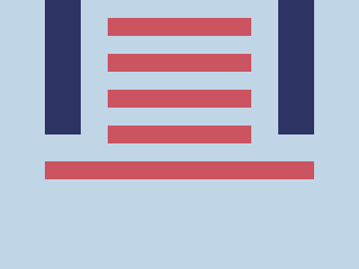

# Daily Target — Sep 29, 2026

Challenge: <https://cssbattle.dev/play/EABR37FZaeuj1tSIEZo3>

## Result

<table>
	<tr>
		<th width="50%">User Submission</th>
		<th width="50%">Target</th>
	</tr>
	<tr>
		<td width="50%" align="center">
			
		</td>
		<td width="50%" align="center">
			
		</td>
	</tr>
</table>

## Code

```html
<style>
  & {
    border-inline:5ch solid #2D3464;
    margin:0 50 150;
    background: #C0D6E7;
    box-shadow:0 32q 0 #C0D6E7, 0 53q #CC5360;   
    *{
      border-block:64q double #CC5360;
      margin:20 30 -10;
```
