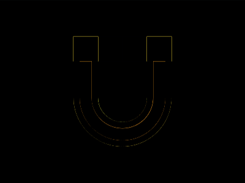
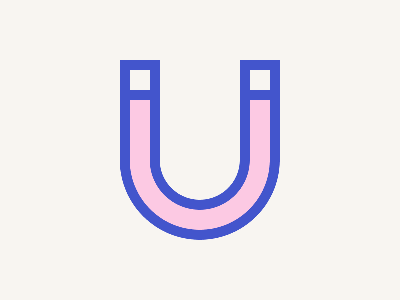

# Daily Target — Sep 30, 2026

Challenge: <https://cssbattle.dev/play/F8dyF0XEp3g1Ff4mG90c>

## Result

<table>
	<tr>
		<th width="50%">User Submission</th>
		<th width="50%">Target</th>
	</tr>
	<tr>
		<td width="50%" align="center">
			
		</td>
		<td width="50%" align="center">
			
		</td>
	</tr>
</table>

## Code

```html
<style>
& {border-radius: 0 0 1in 1in;}
* {
  margin:25%160;
  color:4355cc;
  box-shadow:
    0 0 0 11q,
    var(--a,0 0 0 30px #fcc9e3,0 0 0 5ch);
  background: #f8f5f1;
  * {
    margin: -30 90 110 -30;
    -webkit-box-reflect: right 25vw;
    --a: 0 0 0 11q, 5ch 0 0 11q #f8f5f1;
  }
}
</style>
```
